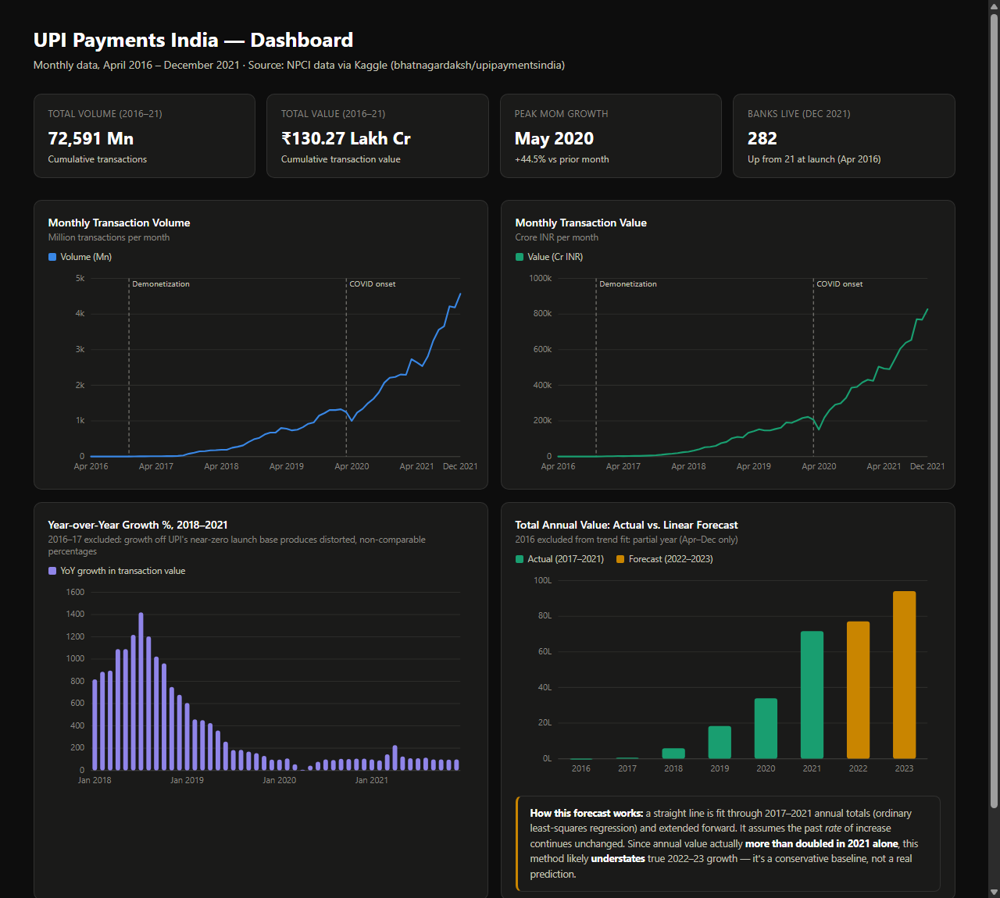

# UPI Payments India — Growth & Policy Analysis (2016–2021)

A data analytics project examining the growth trajectory of India's Unified
Payments Interface (UPI), built as part of preparation for the RBI Young
Professional (Data Analytics and Policy Research) role.

## Objective

To analyze five years of UPI transaction data and answer policy-relevant
questions: How fast did UPI actually grow once launch-year noise is removed?
How did it behave during shocks like demonetization and COVID-19? What does
usage behavior suggest about financial inclusion? The project also
demonstrates a full analytics workflow — cleaning, exploratory analysis, SQL
querying, dashboarding, and forecasting — end to end.

## Dashboard Preview



*Interactive version: [`outputs/dashboard.html`](outputs/dashboard.html) — open it in a browser for hover tooltips on every chart.*

## Dataset

- **Source:** [UPI Payments India](https://www.kaggle.com/datasets/bhatnagardaksh/upipaymentsindia) (Kaggle), originally compiled from NPCI-published statistics.
- **Coverage:** April 2016 – December 2021, monthly (69 rows). Note: despite
  the dataset's Kaggle description mentioning 2022, the data itself only
  extends through December 2021 — this is stated explicitly rather than
  glossed over.
- **Raw columns:** Month, No. of Banks live on UPI, Volume (in Mn), Value (in Cr.)

## Methodology

### 1. Data Cleaning (`scripts/01_clean_data.py`)
- Loaded the raw `.xlsx` and inspected dtypes before trusting them.
- Found and fixed two real data issues:
  - The raw file is sorted **newest-to-oldest**; re-sorted ascending, since
    growth calculations require chronological order.
  - The `Volume` column was read as text because a single cell (June 2017)
    contained a trailing non-breaking space (`\xa0`) — a copy-paste
    artifact. Stripped and cast to numeric.
- Added derived columns: `avg_ticket_size_inr`, `mom_growth_pct`,
  `yoy_growth_pct`. Growth computed from a zero base (UPI's first three
  months, which had no recorded activity) is treated as missing (`NaN`),
  not infinite.
- Output: `data/upi_cleaned.csv`

### 2. Exploratory Analysis (`scripts/02_eda_plots.py`)
- Plotted Volume and Value trends separately (not on a dual axis — dual-axis
  charts can visually mislead by letting two series appear correlated purely
  from independent rescaling).
- Annotated Demonetization (Nov 2016) and COVID onset (Mar 2020) on both
  charts.
- **Growth-statistic framing:** raw growth from UPI's 2016 launch produces
  statistically meaningless percentages (base is near-zero), so headline
  growth figures are reported using full calendar years (2017–2021) instead.
  This is explained in-line in the script output.
- A YoY growth % chart is included, restricted to 2018 onward for the same
  small-base reason — including 2017 compresses the entire chart into a
  flat line near zero.
- Output: `outputs/volume_trend.png`, `outputs/value_trend.png`,
  `outputs/yoy_growth_trend.png`

### 3. SQL Analysis (`scripts/03_sql_analysis.py`)
- Loads the cleaned data into a local SQLite database (`data/upi.db`).
- Runs 10 queries covering: yearly totals, top growth months, year-wise
  value ranking, Pearson correlation between banks-live and volume (computed
  manually — SQLite has no built-in `CORR()`), average ticket size by year,
  new-banks-vs-volume-growth decomposition, calendar-month seasonality, a
  direct 2020-vs-2019 COVID comparison, cumulative value, and a network-
  expansion summary table.
- Each query includes an explanation of why it matters for policy analysis
  (printed alongside the results).

### 4. Dashboards
- **Excel** (`outputs/UPI_Dashboard.xlsx`): KPI cards, Volume/Value line
  charts, YoY growth bar chart, and an actual-vs-forecast bar chart, built
  via `scripts/04_build_dashboard.py` (openpyxl).
- **Web** (`outputs/dashboard.html`): a self-contained interactive HTML
  dashboard with the same charts, hover tooltips, and light/dark mode
  support — usable as a shareable link without opening Excel.
- **Forecast method:** simple linear (least-squares) trend fit on full-year
  totals for 2017–2021 (2016 excluded — it's a partial 9-month year and
  would distort the slope), extended to 2022–2023. This is a deliberately
  naive baseline: it assumes a constant yearly increase, so it likely
  *understates* future growth given that annual value more than doubled in
  2021 alone. This limitation is stated on the dashboard itself, not hidden.

### 5. Policy Brief & Documentation
- `docs/Policy_Brief_UPI_Payments.md`: a 2-page brief covering headline
  growth (using the defensible 2017–2021 baseline), a technology-adoption
  (three-phase) framing of UPI's growth curve, UPI's resilience through
  COVID-19, a financial-inclusion read on stable average ticket size, and
  explicit limitations (aggregate data only, correlation vs. causation, naive
  forecast).
- The brief deliberately **does not** fit a mathematical S-curve/logistic
  ceiling estimate: monthly volume is still rising with no visible
  flattening through Dec 2021, so a fitted saturation point would be
  statistically unstable. We tested this (see project notes) and chose the
  qualitative three-phase description instead, rather than presenting an
  unreliable number as if it were precise.

## Key Findings

- Total annual transaction **value** grew ~126x from 2017 to 2021 (₹57,021 Cr
  → ₹71,59,286 Cr); **volume** grew ~90x over the same period.
- Year-over-year growth peaked around +1,400% in mid-2018 and steadily
  declined to roughly +100% by 2021 — a maturing adoption curve, not a
  business slowdown, since absolute value/volume added kept rising.
- COVID-19's national lockdown (April 2020) slowed YoY growth to its lowest
  point in the series (+6.4%) but **never caused a year-on-year contraction**
  — growth recovered to +43% by May 2020 and exceeded +90% again by mid-2020.
- Banks live on UPI and transaction volume are strongly correlated (Pearson
  r = 0.94) — read as a network-effect association, not proof of causation.
- Average transaction ticket size has stayed in a stable ₹1,300–1,850 band
  since 2017 even as volume grew ~90x, consistent with (but not proof of)
  broadening use for small, everyday payments rather than only large-value
  transfers.

## Tools Used

| Stage | Tool |
|---|---|
| Data cleaning & derived metrics | Python (pandas, numpy) |
| Exploratory charts | Python (matplotlib) |
| Querying | SQL (SQLite via Python's `sqlite3`) |
| Dashboard | Excel (openpyxl-generated) + a self-contained HTML/JS/SVG web dashboard |
| Forecasting | Ordinary least-squares linear trend (numpy `polyfit`) |

## Repository Structure

```
UPI payments India.xlsx        # Original raw dataset (Kaggle)
data/
  upi_cleaned.csv               # Cleaned monthly data with derived columns
  upi.db                        # SQLite database used for SQL analysis
scripts/
  01_clean_data.py              # Cleaning + derived columns
  02_eda_plots.py                # Trend charts + summary growth stats
  03_sql_analysis.py             # SQLite load + 10 analysis queries
  04_build_dashboard.py          # Excel dashboard builder
outputs/
  volume_trend.png, value_trend.png, yoy_growth_trend.png
  UPI_Dashboard.xlsx             # Excel dashboard
  dashboard.html                 # Interactive web dashboard
  dashboard_data.json            # Data feeding the web dashboard
  dashboard_screenshot.png       # Screenshot of dashboard.html, used in this README
docs/
  Policy_Brief_UPI_Payments.md   # 2-page policy brief
README.md
```

## How to Reproduce

```bash
pip install pandas numpy openpyxl matplotlib
python scripts/01_clean_data.py
python scripts/02_eda_plots.py
python scripts/03_sql_analysis.py
python scripts/04_build_dashboard.py
```

## Limitations

This is a national, monthly-aggregate dataset with no state, demographic, or
merchant-level breakdown — findings on financial inclusion and regional
equity are directional, not conclusive. The banks-live/volume correlation
reflects association over a shared growth period, not a proven causal
mechanism. The included forecast is a simple linear baseline for
illustration, not a production-grade prediction.
